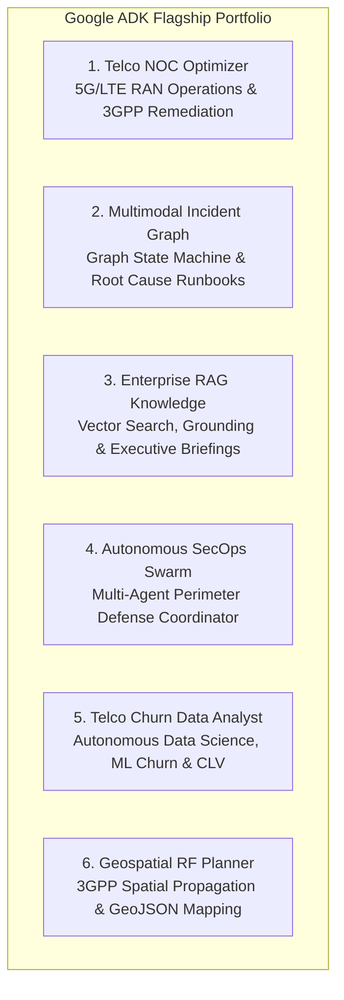
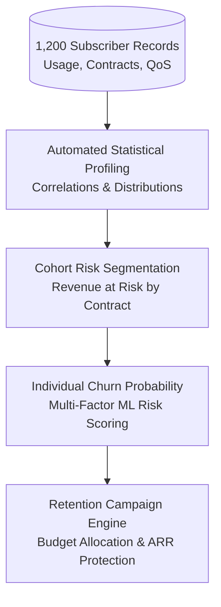
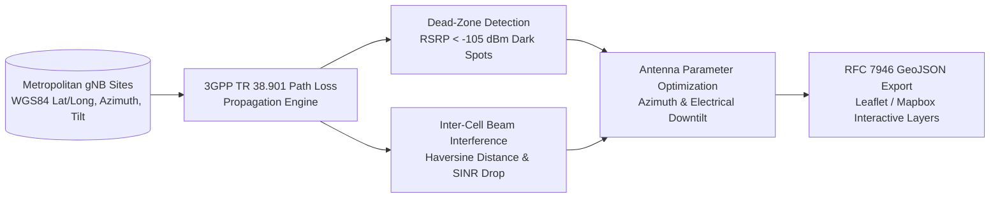

# Google ADK Flagship Agentic AI Portfolio

[](https://adk.dev/)
[](https://ai.google.dev/)
[](https://www.python.org/)
[](https://fastapi.tiangolo.com/)
[](https://pytest.org/)

An enterprise-grade, production-ready **Agentic AI Portfolio** designed and implemented using **Google Agent Development Kit (ADK 2.8.0)** and Google Gemini models.

Tailored specifically to demonstrate advanced agentic engineering, stateful workflows, statistical data science, and spatial physical computing in the **Telecommunications and Cloud Infrastructure** industries.

---

## 🚀 The 6 Portfolio Agent Architectures



---

### 📡 1. Telco NOC Optimizer (`portfolio_agents/telco_noc_optimizer`)
- **Domain**: 5G / LTE Radio Access Networks (RAN) & Core Management.
- **Architecture**: Autonomous Reactive Agent with Dynamic Tool Calling & SLA Impact Estimation.
- **Core Capabilities**:
  - **Telemetry Monitoring**: Continuously ingests cell metrics (PRB load, user plane latency, connected UEs, packet loss).
  - **3GPP Standards Alignment**: Consults **TS 38.401** (NG-RAN Xn load balancing), **TS 23.501** (URLLC latency bounds < 10ms), and **TS 38.331** (RRC reconfiguration).
  - **SLA Liability Engine**: Estimates contractual penalty liability costs in USD.
  - **Automated Mitigation**: Executes `load_balance_xn`, `carrier_aggregation_steer`, and generates verifiable audit tickets (`NOC-INC-2026-XXXX`).

---

### 🕸️ 2. Multimodal Incident Graph (`portfolio_agents/multimodal_incident_graph`)
- **Domain**: Cloud & Telecommunications Distributed Infrastructure Resiliency.
- **Architecture**: Graph Workflow & State Machine Orchestration (`INVESTIGATING` $\rightarrow$ `ROOT_CAUSE_ISOLATED` $\rightarrow$ `VERIFIED_RESOLVED`).
- **Core Capabilities**:
  - **Graph Topology Modeling**: Represents services, physical infrastructure, evidence logs, and runbooks as a directed graph.
  - **Breadth-First Causal Traversal**: Traces symptoms (e.g., 5G UPF packet drop) across graph edges to isolate root causes (e.g. BGP route leaks, optical micro-bends).
  - **Automated Runbook Execution**: Executes operational scripts (`RB-BGP-RESET-01`, `RB-OPTICAL-SWITCHOVER`) with pre-checks and post-verification.
  - **Syslog Telemetry Ingestion**: Parses unstructured syslog anomalies and dynamically binds new evidence nodes into the graph.

---

### 📚 3. Enterprise RAG Knowledge (`portfolio_agents/enterprise_rag_knowledge`)
- **Domain**: Enterprise Technical Specifications & Architectural Standards Retrieval.
- **Architecture**: Semantic Vector Search RAG with Anti-Hallucination Citation Verification.
- **Core Capabilities**:
  - **Semantic Vector Search**: Computes cosine similarity across chunked enterprise whitepapers (5G Standalone SBA slicing, Model Context Protocol MCP, Bare-Metal Edge Kubernetes).
  - **Full Document Retrieval**: Fetches authoritative technical specifications by ID.
  - **Citation Verification Guardrail**: Validates extracted technical claims directly against source sections with confidence scores.
  - **Executive Synthesis**: Generates structured C-level executive briefings tailored to CTOs and Principal Architects.

---

### 🛡️ 4. Autonomous SecOps Swarm (`portfolio_agents/autonomous_secops_swarm`)
- **Domain**: Cybersecurity Perimeter Defense & Threat Hunting Swarm.
- **Architecture**: Hierarchical Multi-Agent Swarm with Coordinator and 3 Specialized Subagents (`sub_agents=[...]`).
- **Subagents**:
  1. **`threat_hunter`**: Scans SIEM logs, detects DDoS amplification and SQLi attacks, extracts forensic IOCs, and computes CVSS v3.1 scores.
  2. **`firewall_mitigator`**: Deploys perimeter firewall ACLs, rate limiting, and BGP Flowspec blackholing (`FW-RULE-XXXX`).
  3. **`soc_dispatcher`**: Packages incident reports and dispatches P1/P2 tickets to Tier-2 On-Call engineers with PagerDuty escalation.
  4. **`root_agent`**: Supervises and coordinates defensive swarm handoffs.

---

### 📊 5. Telco Churn Data Analyst (`portfolio_agents/telco_churn_data_analyst`)
- **Domain**: Telecom Customer Analytics, Churn Prediction & Customer Lifetime Value (CLV) Retention.
- **Architecture**: Autonomous Data Science & Statistical Analytics Agent.
- **Core Capabilities**:
  - **Automated Exploratory Data Analysis (EDA)**: Analyzes subscriber usage distributions, baseline churn rates, ARPU, and Pearson correlation matrices using Pandas & NumPy.
  - **Cohort Risk Segmentation**: Aggregates churn probabilities and monthly revenue at risk across contract types (`Month-to-Month` vs `Two-Year`), 5G device adoption, and support tickets.
  - **Individual Risk Scoring**: Computes multi-factor churn probability scores, isolates top risk drivers, and estimates 24-month CLV loss.
  - **Targeted Retention Campaigns**: Formulates budget-allocated retention packages (e.g. 5G speed boost perk, contract discount) with projected conversion lifts and protected annual recurring revenue.



---

### 🗺️ 6. Geospatial RF Planner (`portfolio_agents/geospatial_rf_planner`)
- **Domain**: Radio Frequency (RF) Spatial Planning, 5G Propagation & GeoJSON Coverage Mapping.
- **Architecture**: Spatial Telecom AI & Antenna Optimization Agent.
- **Core Capabilities**:
  - **Spatial Site Ingestion**: Manages real-world coordinates, antenna heights, bore-sight azimuths, EIRP transmit power, and frequency bands (n78 Mid-Band, n258 mmWave, n71 Low-Band).
  - **Path-Loss Dead-Zone Detection**: Evaluates 3GPP TR 38.901 signal propagation to locate unserved coverage holes (RSRP < -105 dBm).
  - **Inter-Cell Interference & Beam Collisions**: Uses great-circle spherical haversine distance and angular alignment to calculate SINR penalties.
  - **Antenna Optimization**: Adjusts azimuth orientation and electrical downtilt to clear blind spots and contain inter-cell interference.
  - **RFC 7946 GeoJSON Layer Export**: Exports standard FeatureCollections with site points, coverage polygons, and dead-zone circles ready for Leaflet, Mapbox, or QGIS visualization.



---

## 🛠️ Installation & Setup

This repository uses **`uv`** for reproducible dependency management.

### 1. Prerequisites
- Python 3.12+
- `uv` installed (`pip install uv` or via curl/installer)

### 2. Environment Setup
```bash
# Clone the repository
git clone https://github.com/santipenas/Portfolio-Santi-Penas.git
cd adk_test_agent

# Run pytest using uv
uv run pytest portfolio_agents/
```

---

## 🧪 Testing & Verification

### Running the Complete Pytest Suite (39 Tests Passing)
All 6 portfolio agents include comprehensive unit and integration tests covering tools, domain models, edge cases, and agent configurations:

```bash
uv run pytest portfolio_agents/
```
Output:
```
============================= test session starts =============================
portfolio_agents/autonomous_secops_swarm/test_agent.py .....             [ 12%]
portfolio_agents/enterprise_rag_knowledge/test_agent.py ......           [ 28%]
portfolio_agents/geospatial_rf_planner/test_agent.py ........            [ 48%]
portfolio_agents/multimodal_incident_graph/test_agent.py .......         [ 66%]
portfolio_agents/telco_churn_data_analyst/test_agent.py ......           [ 82%]
portfolio_agents/telco_noc_optimizer/test_agent.py .......               [100%]

======================== 39 passed in 1.77s =========================
```

---

## 💻 Running Demonstrations

### 1. Interactive CLI Portfolio Showcase (All 6 Agents)
Experience all 6 agents executing end-to-end operational scenarios in your terminal:
```bash
uv run python demo_portfolio.py
```

### 2. Google ADK Web UI
Launch the official Google ADK FastAPI web server to interact with any of the 6 agents through your browser:
```bash
# Serve all 6 agents in the portfolio
adk web portfolio_agents/
```
Once launched, navigate to `http://127.0.0.1:8000` in your browser.

### 3. Google ADK CLI Single Query
Run queries directly against any agent using the ADK CLI:
```bash
# Query the Telco NOC Optimizer
adk run portfolio_agents/telco_noc_optimizer "Check critical tower status and remediate"

# Query the Churn Data Analyst
adk run portfolio_agents/telco_churn_data_analyst "Profile subscriber dataset and find highest risk churn cohort"

# Query the Geospatial RF Planner
adk run portfolio_agents/geospatial_rf_planner "Detect coverage dead zones and export GeoJSON"
```

---

## 📁 Repository Structure

```
adk_test_agent/
├── demo_portfolio.py                     # End-to-end 6-agent interactive CLI demonstration
├── README.md                             # Flagship portfolio documentation
├── portfolio_agents/
│   ├── telco_noc_optimizer/              # Agent 1: 5G RAN & 3GPP NOC Optimization
│   │   ├── agent.py                      # Root agent definition (gemini-2.5-flash)
│   │   ├── models.py                     # Pydantic schemas (CellTowerMetrics, MitigationResult)
│   │   ├── tools.py                      # 3GPP lookup, telemetry, SLA liability, mitigation
│   │   └── test_agent.py                 # Pytest unit & integration tests
│   ├── multimodal_incident_graph/        # Agent 2: Graph Resiliency & Automated Runbooks
│   │   ├── agent.py                      # Root agent definition (gemini-2.5-flash)
│   │   ├── models.py                     # GraphNode, GraphEdge, RunbookExecutionResult
│   │   ├── tools.py                      # Graph traversal, root cause isolation, runbook execution
│   │   └── test_agent.py                 # Pytest unit & integration tests
│   ├── enterprise_rag_knowledge/         # Agent 3: Enterprise Technical Specifications RAG
│   │   ├── agent.py                      # Root agent definition (gemini-2.5-flash)
│   │   ├── models.py                     # DocumentChunk, CitationValidation, ExecutiveBriefing
│   │   ├── tools.py                      # Vector similarity search, doc retrieval, citation verification
│   │   └── test_agent.py                 # Pytest unit & integration tests
│   ├── autonomous_secops_swarm/          # Agent 4: Multi-Agent Cyber Defense Swarm
│   │   ├── agent.py                      # Swarm coordinator & 3 specialized subagents
│   │   ├── models.py                     # ThreatFeedEntry, FirewallRule, ForensicReport, SOCTicket
│   │   ├── tools.py                      # SIEM feed scan, firewall countermeasure, IOC extraction
│   │   └── test_agent.py                 # Pytest unit & integration tests
│   ├── telco_churn_data_analyst/         # Agent 5: Autonomous Telecom DS & Churn Analytics
│   │   ├── data/                         # Realistic subscriber CSV dataset (1,200 records)
│   │   ├── agent.py                      # Root agent definition (gemini-2.5-flash)
│   │   ├── models.py                     # StatisticalSummary, CohortRiskAnalysis, RetentionCampaign
│   │   ├── tools.py                      # Pandas EDA profiling, cohort analysis, ML risk scoring
│   │   └── test_agent.py                 # Pytest unit & integration tests
│   └── geospatial_rf_planner/            # Agent 6: Geospatial RF 5G & GeoJSON Mapping
│       ├── data/                         # Metropolitan 5G cell sites JSON dataset
│       ├── agent.py                      # Root agent definition (gemini-2.5-flash)
│       ├── models.py                     # CellSiteLocation, CoverageHole, GeoJSONFeatureCollection
│       ├── tools.py                      # Haversine distance, dead-zone detection, GeoJSON export
│       └── test_agent.py                 # Pytest unit & integration tests
```

---

## 👤 Author & Contact

**Santiago Penas**  
- Portfolio: [Portfolio-Santi-Penas](https://github.com/santipenas/Portfolio-Santi-Penas)  
- Focus: Enterprise Agentic AI, Google ADK & Gemini Multi-Agent Architectures
