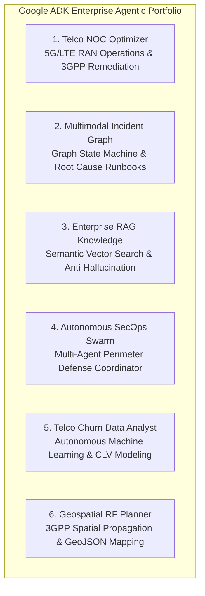

# 🚀 Santiago Penas — AI Engineer | Data Science, Machine Learning & Agentic Systems

[](https://www.python.org/)
[](https://www.docker.com/)
[](https://spark.apache.org/)
[](https://adk.dev/)
[](https://ai.google.dev/)
[](https://pytorch.org/)
[](https://langchain-ai.github.io/langgraph/)
[](https://www.crewai.com/)
[](https://fastapi.tiangolo.com/)
[](https://scikit-learn.org/)
[](https://gymnasium.farama.org/)
[](https://pytest.org/)

<p align="center">
  <b>Production-Grade AI Engineering • Autonomous Agentic Systems • Deep Learning & Reinforcement Learning • Big Data Platforms</b><br>
  <i>Crafted with an MLOps mindset, product thinking, and a relentless passion for intelligent technology by <b>Santiago Penas</b></i>
</p>

<p align="center">
  <a href="https://www.linkedin.com/in/santiagopenas/"></a>
  <a href="https://github.com/santipenas"></a>
  <a href="mailto:penassantiago@gmail.com"></a>
</p>

---

## 📌 Table of Contents

- [🧑‍💻 About Me](#-about-me)
  - [💡 Who I Am & What Drives Me](#-who-i-am--what-drives-me)
  - [🏢 Industry Leadership in Telecommunications](#-industry-leadership-in-telecommunications)
  - [⚡ Modern Paradigms: Agentic AI & Spec-Driven Development](#-modern-paradigms-agentic-ai--spec-driven-development)
  - [🛡️ MLOps, DevOps & Containerization Discipline](#️-mlops-devops--containerization-discipline)
- [⭐ Flagship Engineering Showcases](#-flagship-engineering-showcases)
  - [1. Google ADK 2.8.0 Enterprise Agentic AI Suite](#1--google-adk-280-enterprise-agentic-ai-suite)
  - [2. Autonomous Green Base Station Energy-Saving RL Controller (O-RAN rApp)](#2--autonomous-green-base-station-energy-saving-rl-controller-o-ran-rapp)
  - [3. Production Generative AI, LangGraph, CrewAI & RAG Applications](#3--production-generative-ai-langgraph-crewai--rag-applications)
- [📂 Curated Portfolio Directory](#-curated-portfolio-directory)
  - [🤖 Agentic AI & Autonomous Systems](#-agentic-ai--autonomous-systems)
  - [🌿 Reinforcement Learning & Optimization](#-reinforcement-learning--optimization)
  - [🚀 Generative AI, LLMs & Multi-Agent Swarms](#-generative-ai-llms--multi-agent-swarms)
  - [💬 Conversational AI & Chatbots](#-conversational-ai--chatbots)
  - [🧠 Deep Learning & Neural Architectures](#-deep-learning--neural-architectures)
  - [📈 Machine Learning & Banking Risk Modeling](#-machine-learning--banking-risk-modeling)
  - [🗣️ Natural Language Processing (NLP) & Transformers](#-natural-language-processing-nlp--transformers)
  - [🐘 Big Data & Distributed Computing](#-big-data--distributed-computing)
  - [🧪 Statistical Inference & A/B Experimentation](#-statistical-inference--ab-experimentation)
  - [📊 Data Analytics & Exploratory Storytelling](#-data-analytics--exploratory-storytelling)
  - [⏱️ Time Series & Trend Analysis](#-time-series--trend-analysis)
  - [📐 Mathematical Proofs & Optimization](#-mathematical-proofs--optimization)
  - [🐍 Python Core Engineering & Design Patterns](#-python-core-engineering--design-patterns)
- [🛠 Technical Stack & Tooling Matrix](#-technical-stack--tooling-matrix)
- [🏆 Engineering Philosophy & Production Standards](#-engineering-philosophy--production-standards)
- [📬 Connect with Me](#-connect-with-me)

---

## 🧑‍💻 About Me

### 💡 Who I Am & What Drives Me
I am an **AI Engineer** with a deep foundation in **Data Science**, **Machine Learning**, and **Autonomous Agentic AI**. Above all, I am a genuine **data lover** and a proactive technologist who thrives in **complex Big Data environments**, where massive datasets meet high-concurrency systems.

My passion goes far beyond writing algorithms: I am continuously exploring emerging frontiers in artificial intelligence, cognitive architectures, and scientific computing. I bring a strong **product thinking** mentality to technical engineering—always asking how an AI system can create measurable business value, deliver seamless user experiences, and solve critical bottlenecks rather than simply existing as an offline proof of concept.

### 🏢 Industry Leadership in Telecommunications
Currently, I lead high-impact **Data, Machine Learning, and AI projects in the Telecommunications (Telco) industry**. In this domain, failure is not an option: systems operate under strict SLAs, petabyte-scale streaming telemetry, multi-sector 5G Radio Access Networks (RAN), and complex subscriber dynamics. 
- Leading cross-functional technical teams to ideate, architect, and deploy end-to-end intelligent platforms.
- Bridging the gap between executive strategy and low-level engineering execution.
- Delivering mission-critical solutions: automated network fault isolation, dynamic radio power optimization, customer lifetime value modeling, and multi-agent operations coordinators.

### ⚡ Modern Paradigms: Agentic AI & Spec-Driven Development
I actively embrace modern, innovative software engineering paradigms that accelerate delivery and raise reliability:
- **Agentic AI Engineering**: Moving beyond static LLM completions into autonomous, stateful multi-agent ecosystems (using **Google ADK**, **LangGraph**, **CrewAI**, and **PydanticAI**) equipped with deterministic tool execution, guardrails, and persistent memory.
- **Spec-Driven Development (SDD)**: Utilizing rigorous, specification-first design methodologies to align architecture, interface contracts, automated tests, and agentic workflows. By treating specifications as the single source of truth, I orchestrate the full end-to-end project lifecycle—from formal design to autonomous code generation, validation, and zero-defect deployment.

### 🛡️ MLOps, DevOps & Containerization Discipline
An AI solution is only as valuable as its reliability in production. I champion an **MLOps & DevOps engineering mindset** centered on:
- **Usability & Maintainability**: Writing modular, self-documenting, and decoupled code with comprehensive type safety (**Pydantic v2**) and enterprise testing suites (**Pytest**).
- **Containerization Insights & Docker**: Packaging distributed AI engines, microservices, and web interfaces into deterministic, isolated **Docker** containers for seamless portability across hybrid cloud and on-premise infrastructure.
- **Reproducibility & CI/CD**: Leveraging modern package management ([`uv`](https://docs.astral.sh/uv/)), pinned lockfiles, automated linting, and continuous integration pipelines to guarantee reproducible builds across environments.

---

## ⭐ Flagship Engineering Showcases

### 1. 📡 Google ADK 2.8.0 Enterprise Agentic AI Suite
📁 **Directory:** [`Agentic AI/adk_test_agent/`](./Agentic%20AI/adk_test_agent)  
🛠 **Stack:** Google ADK 2.8.0 • Gemini 2.5 Flash • FastAPI • Pydantic v2 • NetworkX • Docker • Pytest (39/39 passing)

An enterprise-ready, production-grade **Agentic AI Suite** implementing state-of-the-art autonomous agents tailored for high-stakes **Cloud Infrastructure & Telecommunications** operations:



- **Telco NOC Optimizer**: Ingests live cell metrics, aligns decisions with **3GPP TS 38.401 & TS 23.501** specifications, calculates financial SLA contractual penalties in real time, and executes automated mitigations (`load_balance_xn`, `carrier_aggregation_steer`).
- **Multimodal Incident Graph**: Directed acyclic graph workflow engine modeling services, telemetry anomalies, and runbooks with breadth-first causal traversal to isolate root causes (BGP route leaks, optical micro-bends).
- **Enterprise RAG Knowledge**: Vector search with anti-hallucination citation verification guardrails, delivering executive synthesis reports for C-level leadership.
- **Autonomous SecOps Swarm**: Multi-agent perimeter defense coordinator orchestrating specialized sub-agents for automated threat isolation and firewall policy reconfiguration.
- **Telco Churn Data Analyst**: Autonomous agent that ingests raw subscriber data, extracts key driver features, trains scikit-learn churn models, and segments customer lifetime value.
- **Geospatial RF Planner**: Evaluates radio frequency propagation, line-of-sight constraints, and generates standard GeoJSON outputs for cell site densification.
- **Enterprise Quality & Containerization**: Accompanied by **39 automated unit and integration tests** verifying tool execution, error handling, state machine transitions, and Dockerized deployment architecture.

👉 **Explore the full architecture, code, and test suite in [`Agentic AI/adk_test_agent/README.md`](./Agentic%20AI/adk_test_agent/README.md)**.

---

### 2. 🌿 Autonomous Green Base Station Energy-Saving RL Controller (O-RAN rApp)
📁 **Directory:** [`Reinforcement Learning/telco-bs-energy-saving/`](./Reinforcement%20Learning/telco-bs-energy-saving)  
🛠 **Stack:** Python 3.12 • Farama Gymnasium 1.0.0 • Stable-Baselines3 2.5.0 (PPO) • Streamlit • Pandas • UV • Docker

An end-to-end industrial **Deep Reinforcement Learning (DRL)** agent designed for the telecommunications sector. Implemented as an **O-RAN Non-RT/Near-RT RIC rApp**, this agent autonomously schedules 5G macro cell transceiver power states (*Active*, *Shallow Sleep*, *Deep Sleep*) across multi-sector cell sites.

```
                              [ 5G Macro Cell Site Tower ]
                                   /       |       \
                           Sector 1     Sector 2    Sector 3
                          (Azimuth 0°) (Azimuth 120°) (Azimuth 240°)
```

- **Problem Solved**: Telecom Radio Access Networks (RAN) consume 70–80% of total operator power, historically running 100% full transmission power 24/7/365. Heuristic timers fail during unexpected traffic surges, causing network congestion and SLA violations.
- **MDP Formulation**:
  - **State Space**: Normalized current traffic load, active connected UEs, hour-of-day circular encodings, day-of-week, current sleep state, and neighboring sector spare capacity.
  - **Action Space**: Discrete control (`0: Active (1000W)`, `1: Shallow Sleep (500W)`, `2: Deep Sleep (50W)`).
  - **Reward Shaping**: Multi-objective function balancing energy reduction against strict QoS penalties ($-\infty$ penalty on traffic drop or SLA violation).
- **Proven Impact**: **Proximal Policy Optimization (PPO)** cuts electrical power consumption by **25–30%** while maintaining **99.99% QoS** compliance with **0 dropped sessions**.
- **Interactive UI**: Ships with a rich **Streamlit dashboard** allowing operators to simulate real-time traffic surges, inspect hourly state transitions, and evaluate financial OPEX savings.

👉 **Explore the complete mathematical formulation and live application in [`Reinforcement Learning/telco-bs-energy-saving/README.md`](./Reinforcement%20Learning/telco-bs-energy-saving/README.md)**.

---

### 3. 🚀 Production Generative AI, LangGraph, CrewAI & RAG Applications
📁 **Directory:** [`Generative AI Projects/`](./Generative%20AI%20Projects)  
🛠 **Stack:** LangGraph • CrewAI • LangChain • OpenAI GPT-4 • Anthropic Claude • LLaMA • Pinecone • Hugging Face • Docker

A comprehensive suite of production-ready Generative AI systems, multi-agent swarms, and advanced vector search pipelines:

- **LangGraph Multi-Agent Data Analysis**: Stateful graph architecture orchestrating collaborative agents (researcher, coder, analyst) to automate exploratory data analysis and hypothesis generation.
- **CrewAI Web Intelligence & Semantic Research**: Multi-agent autonomous swarm coordinating web scrapers, synthesis agents, and fact-checkers to deliver structured market intelligence.
- **Haystack + Claude Anthropic Issue Resolver**: End-to-end autonomous agent that monitors GitHub repositories, triages incoming issue reports, runs semantic codebase searches, and drafts verified pull requests.
- **Logical Fallacy Elimination Agent**: Advanced prompt engineering and tool-augmented reasoning system that scans long-form news articles, identifies cognitive biases, and rewrites text for neutral, objective balance.
- **Enterprise Vector RAG with Pinecone**: Low-latency semantic question-answering systems leveraging OpenAI embeddings, vector indexing, and dynamic context grounding for complex domain datasets.
- **Deployed Full-Stack Apps**:
  - **PDF Summarizer App** (Hugging Face Spaces deployment with custom UI).
  - **Conversational RAG Streamlit App** (Interactive multi-document querying).
  - **GPTourBA** (Domain-specialized conversational AI for Buenos Aires cultural and urban tourism).
  - **Smart API Orchestration** (Personalized morning briefings synthesizing News, Weather, and OpenAI audio generation).

---

## 📂 Curated Portfolio Directory

### 🤖 Agentic AI & Autonomous Systems
| Project / Subsystem | Key Technologies | Description |
|---|---|---|
| [**Google ADK 2.8.0 Flagship Suite**](./Agentic%20AI/adk_test_agent) | Google ADK, Gemini 2.5 Flash, FastAPI, Pytest | 6 enterprise agents for 5G RAN optimization, incident graph traversal, vector RAG, SecOps defense swarms, churn analytics, and RF planning. |
| [**Telco NOC Optimizer Agent**](./Agentic%20AI/adk_test_agent/portfolio_agents/telco_noc_optimizer) | ADK, 3GPP TS 38.401, SLA Penalty Engine | Ingests cell telemetry, computes dollar-denominated SLA liability, and mitigates congestion via Xn load balancing. |
| [**Multimodal Incident Graph Agent**](./Agentic%20AI/adk_test_agent/portfolio_agents/multimodal_incident_graph) | Graph State Machines, NetworkX, Syslog Parser | Breadth-first causal graph traversal across infrastructure nodes to isolate root causes and trigger automated runbooks. |
| [**Enterprise RAG Knowledge Agent**](./Agentic%20AI/adk_test_agent/portfolio_agents/enterprise_rag_knowledge) | Vector Search, Anti-Hallucination Guardrails | Semantic retrieval over enterprise whitepapers with strict source attribution and C-level executive briefing generation. |
| [**Geospatial RF Planner Agent**](./Agentic%20AI/adk_test_agent/portfolio_agents/geospatial_rf_planner) | GeoJSON, Spatial Propagation, Line-of-Sight | Computes 3GPP propagation loss, evaluates line-of-sight constraints, and generates GeoJSON site layouts. |

---

### 🌿 Reinforcement Learning & Optimization
| Project / Subsystem | Key Technologies | Description |
|---|---|---|
| [**Autonomous 5G Energy RL Controller**](./Reinforcement%20Learning/telco-bs-energy-saving) | Farama Gymnasium 1.0.0, Stable-Baselines3, PPO, Streamlit | O-RAN rApp scheduling 5G base station power sleep states (*Active*, *Shallow Sleep*, *Deep Sleep*) cutting energy consumption by ~30% under zero-SLA-violation constraints. |
| [**Interactive RL Streamlit UI**](./Reinforcement%20Learning/telco-bs-energy-saving/frontend) | Streamlit, Plotly, Pandas | Live dashboard simulating traffic spikes, sector offloading, and financial OPEX savings. |

---

### 🚀 Generative AI, LLMs & Multi-Agent Swarms
| Project Notebook / App | Key Technologies | Highlights |
|---|---|---|
| [**Multi-Agent Workflow with LangGraph**](./Generative%20AI%20Projects/Multi-Agent%20Workflow%20with%20LangGraph%20Data%20Analysis%20Project.ipynb) | LangGraph, LangChain, OpenAI | Stateful multi-agent graph automating exploratory analysis and code execution. |
| [**CrewAI Scalable Web Intelligence Swarm**](./Generative%20AI%20Projects/CrewAI-Powered%20Project%20Scalable%20Web%20Intelligence%2C%20Scraping%20and%20Semantic%20Search.ipynb) | CrewAI, Semantic Search, Web Scraping | Autonomous multi-agent swarm conducting deep web research, filtering, and synthesis. |
| [**GitHub Issue Resolution with Haystack + Claude**](./Generative%20AI%20Projects/AI%20Agent%20for%20GitHub%20Issue%20Resolution%20Using%20Haystack%20%2B%20Claude%20Anthropic.ipynb) | Haystack, Anthropic Claude, GitHub API | Automated triage, semantic code search, and patch generation for software repositories. |
| [**Logical Fallacy Detection & Elimination Agent**](./Generative%20AI%20Projects/An%20AI%20Agent%20for%20Detecting%20and%20Eliminating%20Logical%20Fallacies%20in%20News%20Articles.ipynb) | LLM Prompt Chains, Argument Mining | Identifies logical fallacies and cognitive biases in journalistic content, rewriting with neutral tone. |
| [**Movie Q&A Bot with RAG & Pinecone**](./Generative%20AI%20Projects/Developing%20a%20Movie%20Q%26A%20Bot%20with%20RAG%20Using%20LangChain%2C%20Pinecone%2C%20OpenAI%2C%20and%20OpenEmbedding.ipynb) | LangChain, Pinecone, OpenAI Embeddings | End-to-end vector search retrieval pipeline over extensive multimodal metadata. |
| [**AI-Powered Language Tutor**](./Generative%20AI%20Projects/AI-Powered%20Language%20Tutor.%20%20A%20Personalized%20Learning%20Assistant%20Using%20OpenAI%27s%20Whisper%20and%20GPT.ipynb) | OpenAI Whisper, GPT-4, Speech-to-Text | Personalized audio tutor performing pronunciation analysis and dynamic dialogue generation. |
| [**Automated Email Classifier with LLaMA**](./Generative%20AI%20Projects/Automated%20Email%20Classifier%20with%20LLaMA.ipynb) | Meta LLaMA, Hugging Face, Prompt Tuning | Zero-shot & few-shot intent classification and urgency scoring for enterprise inbox triage. |
| [**Next-Gen Finance: Nasdaq-100 Classification**](./Generative%20AI%20Projects/Next-Gen%20Finance.%20Using%20Generative%20AI%20to%20Classify%20and%20Analyze%20Nasdaq-100%20Stocks.ipynb) | OpenAI, Financial Sentiment, SEC Filings | Analyzes corporate disclosures, earning calls, and market reports for fundamental sentiment. |
| [**Semantic Insights: E-Commerce Reviews**](./Generative%20AI%20Projects/Semantic%20Insights.%20Analyzing%20E-Commerce%20Reviews%20Using%20Embeddings%2C%20Clustering%2C%20and%20t-SNE.ipynb) | Vector Embeddings, t-SNE, K-Means | Unsupervised semantic clustering and dimensionality reduction for voice-of-customer analytics. |
| [**PDF Summarizer App (HF Spaces)**](./Generative%20AI%20Projects/PDF%20Summarizer%20APP%20with%20HuggingFace%20API%20and%20Full%20Deployment%20in%20HF%20Spaces) | Hugging Face Transformers, Gradio/Streamlit | Full cloud-deployed application for chunked document ingestion, summarization, and export. |
| [**PDF Summarizer App (LangChain + OpenAI)**](./Generative%20AI%20Projects/PDF%20Summarizer%20APP%20with%20OpenAI%20API%20and%20LangChain) | Streamlit, LangChain Map-Reduce, OpenAI | Map-Reduce recursive summarization for long-form academic and legal PDF files. |
| [**Smart API Orchestration Project**](./Generative%20AI%20Projects/Smart%20API%20Orchestration%20Project) | Weather API, News API, OpenAI Audio | Synthesizes multiple real-time external APIs into a customized audio daily morning briefing. |

---

### 💬 Conversational AI & Chatbots
| Project Notebook | Key Technologies | Description |
|---|---|---|
| [**Interactive RAG Chatbot with Pinecone & OpenAI**](./Building%20Chatbots/An%20interactive%20Chatbots%20with%20the%20OpenAI%20API%20and%20Pinecone%20using%20a%20RAG%20Workflow.ipynb) | OpenAI API, Pinecone, RAG | Conversational assistant with semantic vector retrieval and context grounding. |
| [**AlienBot Project**](./Building%20Chatbots/Proyecto%20Alienbot.ipynb) | Python, Regex, Intent Parsing | Rule-based and intent-driven conversational agent simulating alien communication. |
| [**Cantina Chatbot Project**](./Building%20Chatbots/ChatBot%20Cantina%20Project.ipynb) | NLP, Multi-turn Dialogue, State Handling | Domain-tailored ordering and customer service dialogue agent. |
| [**ChatterBot Framework Implementation**](./Building%20Chatbots/Building%20a%20Chatbot%20using%20Chatterbot%20framework%28in%20progress%29.ipynb) | ChatterBot, Corpus Training | Corpus-trained conversational model with probabilistic response selection. |

---

### 🧠 Deep Learning & Neural Architectures
| Project Notebook | Key Technologies | Domain & Problem Formulation |
|---|---|---|
| [**Life Expectancy Prediction with TensorFlow**](./Deep%20Learning%20%26%20Neural%20Network%20Projects/AI-Driven%20Life%20Expectancy%20Analysis%20Using%20TensorFlow%20and%20Neural%20Networks.ipynb) | TensorFlow, Keras, Regression | Multi-layer perceptron modeling socioeconomic and public health predictors of longevity. |
| [**Forecasting EV Residential Charging Demands**](./Deep%20Learning%20%26%20Neural%20Network%20Projects/Forecasting%20Residential%20EV%20Charging%20Demands%20with%20Neural%20Networks.ipynb) | Deep Neural Networks, Energy Systems | Temporal and load forecasting to prevent residential distribution grid overload. |
| [**Predicting Hotel Booking Cancellations**](./Deep%20Learning%20%26%20Neural%20Network%20Projects/Data-Driven%20Hospitality.%20Predicting%20and%20Preventing%20Hotel%20Booking%20Cancellations%20.ipynb) | Deep Learning, Imbalanced Classification | Neural classification of reservation cancellations with cost-sensitive loss functions. |
| [**Forest Cover Type Classification**](./Deep%20Learning%20%26%20Neural%20Network%20Projects/Forest%20Cover%20Type%20Classification%20with%20Neural%20Networks.ipynb) | PyTorch / TensorFlow, Multi-Class Softmax | Cartographic and geological feature classification across 7 wilderness forest types. |
| [**Predicting Heart Failure Risk**](./Deep%20Learning%20%26%20Neural%20Network%20Projects/Predicting%20Heart%20Failure%20Risk%20Using%20Machine%20Learning.%20A%20Neural%20Network%20Approach.ipynb) | Neural Networks, Clinical Biometrics | Clinical risk prediction utilizing physiological telemetry and blood biomarkers. |
| [**Perceptron Logic Gates**](./Deep%20Learning%20%26%20Neural%20Network%20Projects/Logic%20Gates%20Classification%20using%20Perceptron.ipynb) | Foundational Perceptron, NumPy | Implementation of linear decision boundaries from first mathematical principles. |

---

### 📈 Machine Learning & Banking Risk Modeling
| Project Notebook | Key Technologies | Methodology & Value Delivered |
|---|---|---|
| [**Credit Risk & Banking Supervised Learning**](./Machine%20Learning%20Projects/Credit%20Risk%20and%20Banking%20Machine%20Learning%20Project%20for%20Supervised%20Learning.ipynb) | Scikit-Learn, LightGBM/XGBoost, ROC-AUC | Enterprise default prediction, credit scoring, precision-recall optimization, and risk tiering. |
| [**Credit Card Fraud Detection**](./Machine%20Learning%20Projects/Credit%20Card%20Fraud%20Detection%20using%20Logistic%20Regression.ipynb) | Logistic Regression, SMOTE, PR-AUC | Extreme class-imbalance classification identifying fraudulent financial transactions. |
| [**Obesity Prediction with Feature Wrapper Methods**](./Machine%20Learning%20Projects/Optimizing%20Obesity%20Prediction%20Using%20Wrapper%20Methods%20for%20Feature%20Selection.ipynb) | Sequential Feature Selection (SFS), RFE | Dimension reduction and feature selection maximizing model interpretability and accuracy. |
| [**Random Forest Income Classification**](./Machine%20Learning%20Projects/Machine%20Learning%20Project.%20Random%20Forest%20Classification%20to%20predict%20income%20levels.ipynb) | Random Forest, Decision Trees, Census Data | Ensemble modeling and feature importance analysis for socioeconomic demographic segmentation. |
| [**Breast Cancer Diagnostic Classification**](./Machine%20Learning%20Projects/Breast%20Cancer%20Classification%20Using%20K-Nearest%20Neighbors.ipynb) | K-Nearest Neighbors, Fine-Tuning | Fine-needle aspirate biopsy classification with distance metric tuning and threshold optimization. |
| [**ML Hyperparameter Tuning Suite**](./Machine%20Learning%20Projects/Machine%20Learning%20Hyperparameter%20Tuning%20Project.ipynb) | GridSearchCV, RandomizedSearchCV, K-Fold | Systematic hyperparameter optimization comparing cross-validated performance surfaces. |
| [**Linear Regression & Statsmodels Analysis**](./Machine%20Learning%20Projects/Linear%20Regression%20%20Statsmodels%20Analysis.ipynb) | Statsmodels, OLS, Residual Diagnostics | Econometric regression evaluating p-values, multicollinearity (VIF), and heteroskedasticity. |
| [**Tennis Performance Analytics**](./Machine%20Learning%20Projects/Tennis%20Performance%20Metrics%20with%20Regression%20Models%20.ipynb) | Multiple Linear Regression, Sports Analytics | Predictive model tying serve velocity, unforced errors, and break points to match outcomes. |

---

### 🗣️ Natural Language Processing (NLP) & Transformers
| Project Notebook | Key Technologies | Focus & Pipeline |
|---|---|---|
| [**Aspect-Based Movie Classification**](./NLP%20%26%20%20LLM%C2%B4s%20%20Projects/Aspect-Based%20Classification%20for%20Movies%20with%20TinyBERT%2C%20Hugging%20Face%20Transformers%2C%20and%20PyTorch.ipynb) | TinyBERT, PyTorch, Hugging Face | Fine-tuned compact transformer for aspect-level sentiment decomposition. |
| [**Analysis of Presidential Speeches**](./NLP%20%26%20%20LLM%C2%B4s%20%20Projects/Analysis%20of%20Presidential%20Speeches%20and%20Textual%20Insights.ipynb) | NLTK, Lexical Diversity, Frequency | Historical NLP linguistic analysis examining rhetorical styles and vocabulary evolution. |
| [**Syntactic Patterns in Classic Literature**](./NLP%20%26%20%20LLM%C2%B4s%20%20Projects/Exploring%20Syntactic%20Patterns%20in%20Classic%20Literature%20Using%20NLP.ipynb) | SpaCy, Dependency Parsing, POS Tagging | Grammatical tree structures and syntactic style signatures across classical authors. |
| [**Mystery Friend: Author Identification**](./NLP%20%26%20%20LLM%C2%B4s%20%20Projects/Mystery%20Friend.%20Author%20Identification%20Using%20Multinomial%20Naive%20Bayes%20and%20NLP%20Techniques.ipynb) | Multinomial Naive Bayes, Bag-of-Words | Stylometric classification determining authorship attribution from text samples. |
| [**Key Term Extraction with TF-IDF**](./NLP%20%26%20%20LLM%C2%B4s%20%20Projects/Text%20Insights.%20Extracting%20Key%20Terms%20with%20NLP%20%26%20TF-IDF.ipynb) | TF-IDF Vectorization, N-Grams | Automated extraction of domain-specific keywords and document topic signatures. |
| [**SMS Spam & Sentiment Classification**](./NLP%20%26%20%20LLM%C2%B4s%20%20Projects/NLP%20%26%20SMS%20Sentiment%20Analysis%20Project.ipynb) | Text Preprocessing, Classification Pipelines | Spam filtering and sentiment classification with tokenization and stemming. |

---

### 🐘 Big Data & Distributed Computing
| Project Notebook | Key Technologies | Scale & Scope |
|---|---|---|
| [**Common Crawl PySpark Analysis**](./Big%20Data%20Projects/Analyze%20Common%20Crawl%20Data%20with%20PySpark.ipynb) | PySpark, Distributed RDDs/DataFrames | Distributed querying, schema definition, and aggregation of web-scale Common Crawl extracts. |
| [**Wikipedia Clickstream Big Data Analysis**](./Big%20Data%20Projects/PySpark%20for%20Big%20Data.%20Analyzing%20Wikipedia%20Clickstream%20Data.ipynb) | PySpark SQL, Graph Flow, Big Data | Navigational flow graph analysis over millions of Wikipedia clickstream transitions. |

---

### 🧪 Statistical Inference & A/B Experimentation
| Project Notebook | Key Technologies | Experimental Design & Insights |
|---|---|---|
| [**Farmburg Price Optimization A/B Test**](./Statistics%2C%20Testing%20and%20AB%20Testing%20Projects/Testing%20Analysis%20for%20Price%20Optimization.%20Farmburg%27s%20AB%20Test.ipynb) | Chi-Square Test, Binomial Test, Revenue Modeling | Multi-variant pricing elasticity test determining the revenue-maximizing price point. |
| [**Nosh Mish Mosh A/B Test**](./Statistics%2C%20Testing%20and%20AB%20Testing%20Projects/AB%20Testing%20at%20Nosh%20Mish%20Mosh.ipynb) | Power Analysis, Sample Size Determination | Statistical experiment sizing to ensure adequate statistical power for conversion lifts. |
| [**ShoeFly Conversion Rate Testing**](./Statistics%2C%20Testing%20and%20AB%20Testing%20Projects/Testing%20for%20ShoeFly%20Project.ipynb) | Two-Sample Proportion Tests, Hypothesis Testing | Ad campaign click-through rate optimization across target marketing channels. |
| [**Dog Breed Data Statistical Testing**](./Statistics%2C%20Testing%20and%20AB%20Testing%20Projects/Dog%20Data%20Analysis%20Project.%20Insights%20Through%20Statistical%20Testing%20and%20Visualization.ipynb) | ANOVA, Tukey HSD, Seaborn | Analysis of variance across multi-group biometric distributions. |
| [**Spotify & Music Sample Distributions**](./Statistics%2C%20Testing%20and%20AB%20Testing%20Projects/Sample%20Distributions%20%20Dance%20Party%20Music%20and%20Spotify%20Analysis.ipynb) | Central Limit Theorem, Bootstrapping | Sampling distributions, standard error, and confidence intervals on Spotify audio features. |

---

### 📊 Data Analytics & Exploratory Storytelling
| Category | Projects | Highlights |
|---|---|---|
| **Data Analytics & Descriptive Stats** | [Jeopardy Analysis](./Data%20Analytics%20%26%20Descriptive%20Statistics/Analyzing%20Jeopardy%20Data.ipynb) • [NBA Trend Project](./Data%20Analytics%20%26%20Descriptive%20Statistics/NBA%20Trend%20Project.ipynb) • [E-Commerce Funnels](./Data%20Analytics%20%26%20Descriptive%20Statistics/E-Commerce%20Funnel%20Basic%20Analysis.ipynb) • [Census Variables](./Data%20Analytics%20%26%20Descriptive%20Statistics/Census%20Variables.ipynb) | Granular cohort analyses, conversion funnel drop-off identification, and statistical distribution modeling. |
| **Exploratory Data Analysis (EDA)** | [Flight Delay Patterns](./Data%20Science%20%26%20Exploratory%20Data%20Analysis/Data%20Flight%20Analysis.ipynb) • [Decoding Dating Profiles](./Data%20Science%20%26%20Exploratory%20Data%20Analysis/Decoding%20Dating.%20A%20Data-Driven%20Exploration%20of%20Online%20Dating%20Profiles.ipynb) • [Mushroom Data](./Data%20Science%20%26%20Exploratory%20Data%20Analysis/Exploring%20and%20Visualizing%20%20Data%20from%20Mushrooms.ipynb) • [Student Outcomes](./Data%20Science%20%26%20Exploratory%20Data%20Analysis/Students%20Data%20Analysis.ipynb) | Multivariate visualization, missing data imputation, outlier detection, and data-driven storytelling. |

---

### ⏱️ Time Series & Trend Analysis
| Project Notebook | Key Technologies | Highlights |
|---|---|---|
| [**Sublime Limes Time Series Analysis**](./Time%20Series%20Projects%20%28uploading%20soon%29/Sublime%20Limes.ipynb) | Matplotlib, Seaborn, Trend Decomposition | Seasonal pattern analysis, temporal demand fluctuations, and comparative line/bar visualization. |

---

### 📐 Mathematical Proofs & Optimization
| Project Notebook | Mathematical Foundations | Focus |
|---|---|---|
| [**Limit Definition of the Derivative Exploration**](./Algebra%20and%20Math%20Projects/Limit%20Definition%20of%20the%20Derivative%20Exploration.ipynb) | Calculus, First Principles Limits, Secant Lines | Computational visualization of infinitesimal limits, tangent approximations, and continuous differentiability. |
| [**Vector Algebra Analysis Project**](./Algebra%20and%20Math%20Projects/Vector%20Algebra%20Analysis%20Project.ipynb) | Linear Algebra, Dot/Cross Products, Projections | Vector spaces, geometric transformations, and multidimensional basis projections for ML. |

---

### 🐍 Python Core Engineering & Design Patterns
📁 **Directory:** [`Python/`](./Python)  
A collection of modular scripts and production patterns demonstrating clean code practices:
- **Object-Oriented Programming (OOP)**: Custom classes, inheritance, dunder methods, and data encapsulation.
- **Iterators & Generators**: Memory-efficient stream processing using generator functions and custom iterator protocols.
- **Functional Programming & Higher-Order Functions**: Lambda functions, map/filter/reduce pipelines, and list comprehensions.
- **Custom Logging & Telemetry**: Configured logging pipelines with structured loggers and formatting handlers.
- **Algorithmic Utilities**: String manipulations, nested dictionary parsing, and algorithmic problem-solving.

---

## 🛠 Technical Stack & Tooling Matrix

```
┌──────────────────────────────────────┬─────────────────────────────────────────────────────────────────────────────┐
│ Domain / Discipline                  │ Technologies, Libraries & Frameworks                                        │
├──────────────────────────────────────┼─────────────────────────────────────────────────────────────────────────────┤
│ 🤖 Agentic AI & Autonomous Systems   │ Google ADK 2.8.0, LangGraph, CrewAI, Haystack, AutoGen, PydanticAI          │
│ 🧠 LLMs & Generative AI Pipelines    │ Gemini 2.5 / 1.5, OpenAI (GPT-4, Whisper), Anthropic Claude, Meta LLaMA     │
│ 🔍 Vector Databases & Semantic RAG   │ Pinecone, ChromaDB, FAISS, LangChain, Hybrid Keyword/Dense Search Rerankers │
│ 🌿 Reinforcement Learning & Control  │ Farama Gymnasium 1.0.0, Stable-Baselines3, PPO, DQN, MDP Formulation       │
│ ⚡ Deep Learning & Neural Nets       │ PyTorch 2.x, TensorFlow 2.x, Keras, Transformers (Hugging Face), CNNs, MLPs│
│ 📈 Machine Learning & Modeling       │ Scikit-Learn, XGBoost, LightGBM, CatBoost, Statsmodels, Feature Engine      │
│ 🐘 Big Data & Distributed Computing  │ Apache Spark (PySpark), Spark SQL, Distributed DataFrames, Parquet, HDFS    │
│ 📊 Data Wrangling & Analysis         │ Pandas, Polars, NumPy, SciPy                                                │
│ 📈 Data Visualization & UI Apps      │ Streamlit, Plotly, Seaborn, Matplotlib, Gradio                              │
│ 🐳 MLOps, DevOps & Containerization  │ Docker, Container Lifecycle & Networking, FastAPI, Pydantic v2, uv, CI/CD   │
│ 🧪 Testing & Code Reliability        │ Pytest (Unit & Integration), Spec-Driven Contracts, Type Hinting, Ruff/Black│
└──────────────────────────────────────┴─────────────────────────────────────────────────────────────────────────────┘
```

---

## 🏆 Engineering Philosophy & Production Standards

- **Product-Driven AI Engineering**: Deep technical competence paired with an obsession for end-user usability and quantifiable ROI. Every model or agent is designed as a maintainable product component rather than a standalone experiment.
- **Spec-Driven Development (SDD)**: Architecting systems starting from rigorous interface definitions, input/output schemas, and functional behavioral specifications before implementation, guaranteeing cross-team cohesion and deterministic execution.
- **Containerization & Environment Parity**: Employing **Docker** containerization patterns to eliminate environment discrepancies between local development, testing, and production clusters.
- **Strict Telecom & Industry SLA Standards**: Engineering solutions compliant with international telecommunications benchmarks (e.g., **3GPP TS 38.401, TS 23.501, TS 38.331**; O-RAN rApp specifications).
- **Automated Verification & Zero-Regressions**: Enforcing strict testing discipline with **Pytest** covering happy paths, edge cases, synthetic fault injections, and state machine transitions.
- **Modern, Deterministic Tooling**: Standardizing on ultra-fast packaging ([`uv`](https://docs.astral.sh/uv/)), strict lockfiles, and **Pydantic v2** for robust data validation and runtime schema enforcement.

---

## 📬 Connect with Me

I am always interested in discussing technical challenges, innovative AI architectures, open-source projects, and new professional opportunities.

<p align="left">
  <a href="https://www.linkedin.com/in/santiagopenas/"></a>
  <a href="https://github.com/santipenas"></a>
  <a href="mailto:penassantiago@gmail.com"></a>
</p>

- 📧 **Email:** [penassantiago@gmail.com](mailto:penassantiago@gmail.com)
- 💼 **LinkedIn:** [linkedin.com/in/santiagopenas](https://www.linkedin.com/in/santiagopenas/)
- 📁 **GitHub Repository:** [github.com/santipenas/Portfolio-Santi-Penas](https://github.com/santipenas/Portfolio-Santi-Penas)

---

<p align="center">
  <i>"Simplicity is prerequisite for reliability." — Edsger W. Dijkstra</i><br>
  ⭐️ <b>Star this repository if you find these projects, agentic architectures, and Big Data workflows valuable!</b>
</p>
